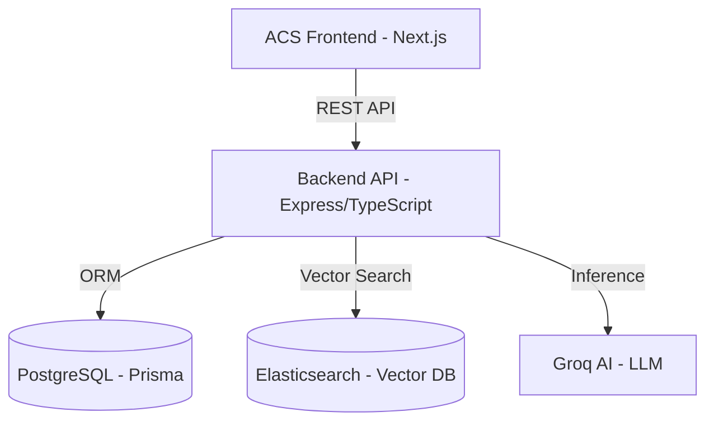

# Application Architecture Overview

This document provides a high-level overview of the application's architecture, technology stack, and data flow.

## System Architecture

The application follows a modern client-server architecture with a clear separation between the frontend and backend.

## Frontend (acs-frontend)

Built with **Next.js 14 (App Router)**, the frontend provides a responsive and interactive user interface for analysts.

### Key Technologies

- **Framework**: Next.js 14
- **UI Components**: Shadcn UI (Radix UI + Tailwind CSS)
- **Icons**: Lucide React
- **Visualization**:
  - **D3.js & Recharts**: For data charts and graphs.
  - **Vis-network**: For ontology and connection mapping.
- **State Management**: React Hooks (`useChat`, `useRAG`, `useWorkspace`) and Context API.
- **Animations**: Framer Motion

### Core Modules

- `analyst-workspace`: The primary interface for data analysis and AI interaction.
- `ai-model`: Handles model selection and configuration.
- `chat`: Manages conversational interfaces and history.
- `ontology`: Visualizes relationships between entities.

---

## Backend (backend)

A robust **Node.js/TypeScript** application using the **Express** framework.

### Key Technologies

- **Runtime**: Node.js with TypeScript
- **Framework**: Express.js
- **ORM**: Prisma
- **Database**: PostgreSQL
- **Vector Search**: Elasticsearch
- **AI Integration**: Groq SDK (LLM) & Xenova Transformers (Local Embeddings)

### Services & Logic

- **RagService**: Orchestrates the Retrieval-Augmented Generation flow.
- **GroqService**: Manages communication with the Groq AI models.
- **DocumentExtractorService**: Handles parsing of various file formats (PDF, DOCX, XLSX) using libraries like `pdf-parse` and `mammoth`.
- **EmbeddingService**: Generates vector representations of text for semantic search.

---

## Data Flow: RAG Process

1. **Document Ingestion**:
   - User uploads a document through the frontend.
   - Backend extracts text (DocumentExtractorService).
   - Text is chunked and embeddings are generated (EmbeddingService).
   - Content and embeddings are stored in PostgreSQL and indexed in Elasticsearch.

2. **AI Querying (RAG)**:
   - User sends a query via the chat interface.
   - Backend retrieves relevant document chunks from Elasticsearch based on semantic similarity.
   - The original query + retrieved context is sent to Groq AI.
   - The AI response is streamed back to the frontend and saved to history.

## Development & Deployment

- **Frontend**: `npm run dev` (Port 3000)
- **Backend**: `npm run dev` (Port 5000)
- **Containerization**: Docker Compose (for PostgreSQL/Elasticsearch)
- **Process Manager**: Ecosystem (PM2) for production.
