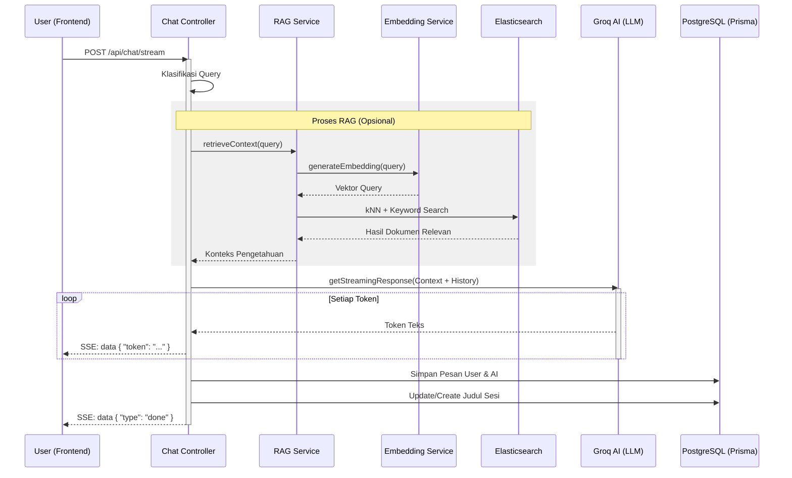

# Arsitektur Detail: Alur Percakapan (User Chat to End)

Dokumen ini merinci langkah demi langkah teknis yang terjadi saat pengguna mengirimkan pesan hingga asisten memberikan jawaban dan data tersimpan.

## Ringkasan Alur (High-Level)

1.  **Frontend**: Menangani input, mengelola riwayat di UI, dan membuka koneksi streaming.
2.  **Controller**: Menerima request, mengklasifikasikan pertanyaan, dan mengorkestrasi layanan lainnya.
3.  **RAG Service**: Mencari konteks pengetahuan yang relevan dari database internal.
4.  **Groq Service**: Mengirim prompt lengkap (instruksi + konteks + riwayat) ke AI (LLM).
5.  **Streaming**: Mengirim jawaban ke pengguna kata demi kata (token) secara real-time.
6.  **Persistence**: Menyimpan percakapan secara permanen ke database SQL.

---

## Detail Langkah-Langkah Teknis

### 1. Trigger di Frontend

- Saat pengguna menekan tombol "Send", fungsi `handleProcess` di dalam hook `useChat.ts` dipanggil.
- Pesan pengguna langsung ditambahkan ke state `chatHistory` lokal agar muncul di layar secara instan.
- Layanan `aiQueryService.processQuery` dipanggil untuk memulai komunikasi dengan backend.

### 2. Koneksi API (Streaming SSE)

- Frontend menggunakan fungsi `fetch` dengan mode streaming untuk memanggil endpoint `/api/chat/stream` di Backend.
- Koneksi ini menggunakan **Server-Sent Events (SSE)**, yang memungkinkan server mengirimkan data berkali-kali dalam satu koneksi yang tetap terbuka.

### 3. Klasifikasi & Intelijen (Backend)

Endpoint di `chat.controller.ts` menerima request dan melakukan:

- **Validasi Input**: Memeriksa panjang karakter dan format data.
- **Klasifikasi Pertanyaan**: Menggunakan fungsi `shouldSkipRAG` untuk menentukan apakah pertanyaan membutuhkan pencarian dokumen (RAG) atau cukup dijawab dengan pengetahuan umum AI.

### 4. Proses Retrieval-Augmented Generation (RAG)

Jika pertanyaan memerlukan data dokumen, `RagService` akan bekerja:

- **Embedding**: Pertanyaan pengguna dikirim ke `EmbeddingService` untuk diubah menjadi vektor (angka-angka koordinat).
- **Hybrid Search**: Melakukan pencarian di **Elasticsearch** menggunakan dua metode sekaligus:
  - **kNN Search**: Mencari dokumen dengan makna yang paling mirip (secara vektor).
  - **BM25 Search**: Mencari dokumen berdasarkan kecocokan kata kunci yang persis.
- **Merge Context**: Menggabungkan hasil pencarian dan mengambil maksimal 5 potongan teks yang paling relevan.

### 5. Interaksi dengan AI (Groq LLM)

- Backend menyusun **System Prompt** yang berisi:
  1.  Instruksi kepribadian asisten.
  2.  Konteks dokumen yang baru saja ditemukan.
  3.  Riwayat percakapan sebelumnya (agar asisten ingat konteks chat).
- Data ini dikirim ke layanan Groq menggunakan model yang dipilih (misal: `llama3-70b-8192`).

### 6. Streaming Jawaban ke UI

- Saat AI mulai menghasilkan teks, setiap kata (token) dikirim kembali ke frontend melalui koneksi SSE yang masih terbuka.
- Frontend menangkap token tersebut (melalui hook `useChat`) dan memperbarui tampilan UI secara real-time, memberikan efek asisten sedang "mengetik".

### 7. Penyelesaian & Penyimpanan (Post-Processing)

Setelah AI selesai memberikan jawaban lengkap:

- **Save History**: Backend menyimpan pesan _User_ dan pesan _Assistant_ ke tabel `ChatHistory` di **PostgreSQL** melalui Prisma.
- **Auto-Title**: Jika ini adalah pesan pertama dalam sesi, backend memanggil LLM lagi secara efisien untuk membuat judul singkat bagi percakapan tersebut.
- **Update Session**: Memperbarui timestamp `updatedAt` pada sesi chat agar urutan di sidebar tetap akurat.

---

## Diagram Urutan Detail (Sequence Diagram)

