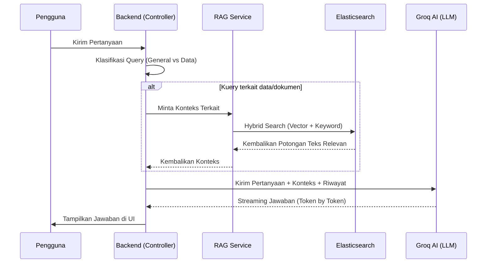

# Cara Kerja Sistem (Workflow)

Dokumen ini menjelaskan proses teknis dibalik fitur utama aplikasi ACS, yaitu pengolahan dokumen dan sistem tanya jawab cerdas (RAG).

## 1. Proses Ingest Dokumen (Pemuatan Data)

Saat pengguna mengunggah dokumen (PDF, Docx, Excel, atau CSV), sistem menjalankan langkah-langkah berikut:

### Ekstraksi Teks Cerdas (Hybrid Extraction)

Sistem menggunakan strategi bertingkat untuk mendapatkan teks berkualitas tinggi:

- **LlamaParse (Utama)**: Menggunakan AI untuk mengubah dokumen kompleks (terutama yang memiliki tabel) menjadi format Markdown yang rapi.
- **Local Fallback (Cadangan)**: Jika LlamaParse gagal atau tidak tersedia, sistem menggunakan pustaka lokal:
  - `pdf2json`: Untuk PDF (dengan algoritma penyusunan baris agar tabel tetap terbaca).
  - `mammoth`: Untuk file Word (.docx).
  - `xlsx`: Untuk file Excel dan CSV.

### Vektorisasi & Penyimpanan

Setelah teks didapatkan:

1. **Penyimpanan Database**: Teks asli disimpan di **PostgreSQL** melalui Prisma.
2. **Embedding**: Teks dikirim ke **Embedding Service** (menggunakan model `Xenova/all-MiniLM-L6-v2`) untuk diubah menjadi koordinat angka (vektor).
3. **Indexing**: Vektor dan teks disimpan di **Elasticsearch** agar pencarian berdasarkan "makna" (semantic search) bisa dilakukan dengan sangat cepat.

---

## 2. Aliran Tanya Jawab AI (RAG Workflow)

Saat pengguna mengajukan pertanyaan di chat, sistem tidak langsung menjawab, melainkan melakukan proses berikut:

### Detail Langkah:

1. **Klasifikasi Query**: Sistem memeriksa apakah pertanyaan bersifat umum (seperti "Halo") atau membutuhkan data (seperti "Berapa jumlah serangan siber?"). Jika umum, sistem melewati proses pencarian data untuk menghemat waktu.
2. **Hybrid Search**: Sistem mencari referensi di Elasticsearch menggunakan dua metode sekaligus:
   - **Semantic Search**: Mencari berdasarkan kecocokan makna.
   - **Keyword Search**: Mencari berdasarkan kecocokan kata kunci yang persis.
3. **Pencarian Proaktif**: Jika pengguna bertanya tentang "file yang baru diunggah", sistem secara otomatis memprioritaskan dokumen yang masuk dalam 5 menit terakhir.
4. **Pembentukan Prompt**: Sistem menggabungkan pertanyaan pengguna, riwayat percakapan, dan referensi dokumen yang ditemukan menjadi satu instruksi lengkap untuk AI.
5. **Jawaban Streaming**: AI (Groq) memberikan jawaban secara bertahap (streaming) agar pengguna bisa langsung membaca tanpa menunggu proses selesai sepenuhnya.

---

## 3. Fitur Keamanan & Validasi

- **Rate Limiting**: Membatasi jumlah permintaan untuk mencegah penyalahgunaan.
- **Session Management**: Setiap percakapan disimpan dalam sesi yang terikat pada akun pengguna.
- **Feedback Loop**: Pengguna dapat memberikan rating (jempol atas/bawah) pada jawaban AI untuk membantu pengembangan kualitas di masa depan.
